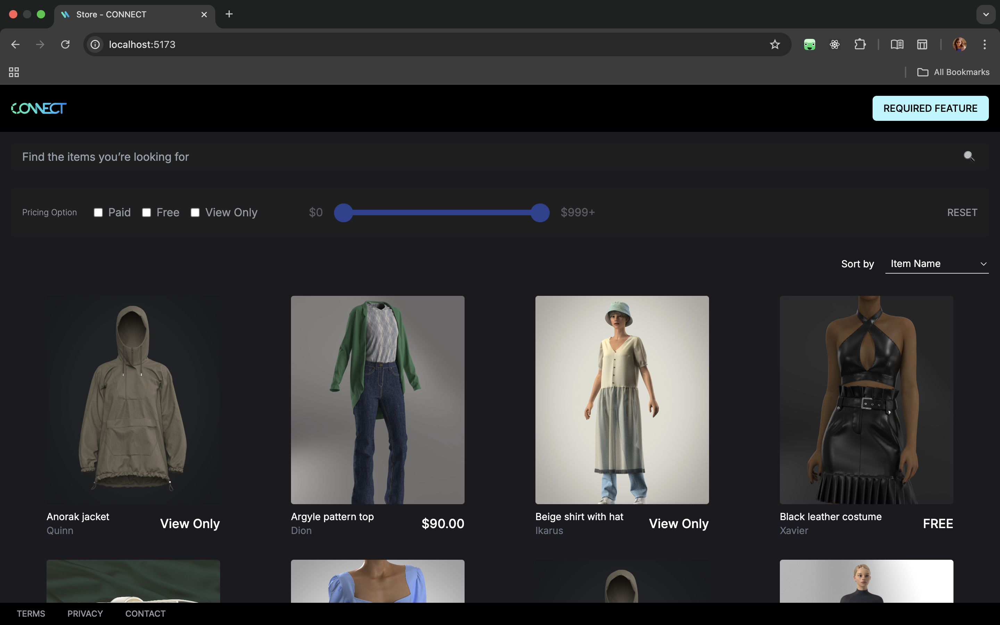

# 🧵 Connect UI – Digital Content Browser

A sleek and responsive UI built using **React**, **TypeScript**, **Vite**, and **Tailwind CSS** that allows users to **search**, **filter**, **sort**, and **browse** digital content items with **infinite scrolling**.



---

## 📚 Overview

This project was created as part of a frontend developer interview assignment. It simulates a real-world digital marketplace interface where users can:

- 🔍 Search contents by keyword
- 🧰 Filter by pricing option (Paid, Free, View Only)
- 🎚 Adjust a dual-handle price range slider
- 📊 Sort by item name or price
- ♾ Browse items with infinite scroll

---

## 🚀 Tech Stack

| Tech            | Description                               |
|-----------------|-------------------------------------------|
| React           | JavaScript library for UI development     |
| TypeScript      | Static typing for predictable code        |
| Vite            | Lightning-fast bundler and dev server     |
| Tailwind CSS    | Utility-first CSS framework               |
| Redux Toolkit   | State management for filters and search   |
| Custom Hooks    | `useInfiniteScroll`, `useFilterState` etc |

---

## 📁 Project Structure (sample)

src/
├── assets/ # Static assets (e.g. images, fonts)
├── components/ # Reusable UI components
│ ├── Card.tsx
│ ├── ContentsList.tsx
│ ├── ContentsFilter.tsx
│ ├── RangeSlider.tsx
├── hooks/ # Custom React hooks
│ ├── useInfiniteScroll.ts
│ ├── useFilterState.ts
├── slices/ # Redux slices for filters
├── store.ts # Redux store setup
├── types/ # Shared type definitions
├── App.tsx # Root component
├── main.tsx # Entry point


---

## 🧪 Features

### 🔍 Search
Users can type keywords and hit Enter or click the 🔍 icon to search item titles.

### 🧰 Pricing Filter
Toggle between:
- Paid
- Free
- View Only

### 🎚 Price Range Slider
Drag two slider thumbs to set the minimum and maximum price. Slider is interactive **only** when “Paid” is selected.

### 🧹 Reset
Reset all filters to default values with one click.

### 📊 Sorting
Sort items using a dropdown menu:
- Item Name
- Price: Low to High
- Price: High to Low

### ♾ Infinite Scroll
Scroll through a long list of items – more items load dynamically as you reach the bottom of the page.

---

## 🌐 Environment Variables

Create a `.env` file in the root directory to define environment-specific variables.

```env
VITE_API_URL=https://closet-recruiting-api.azurewebsites.net


## 🛠 Setup Instructions

1. Clone the repository
```bash
git clone https://github.com/iitkshriya/ClosetConnect.git
cd ClosetConnect
```

2. Install dependencies
```bash
npm install
```

3. Run locally
```bash
npm run dev
```

4. Build for production
```bash
npm run build
```

## 🧹 Improvements (future scope)

Add backend API integration for dynamic content

Add unit and integration tests using Vitest or React Testing Library

Improve accessibility (ARIA roles for sliders and checkboxes)

Make the UI responsive for mobile design